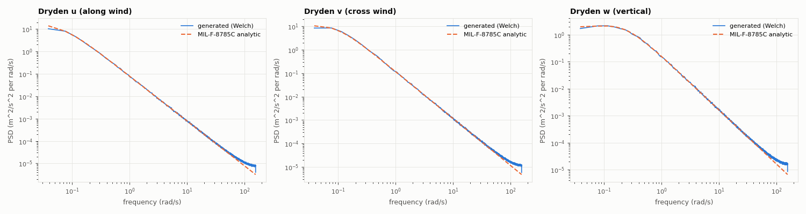
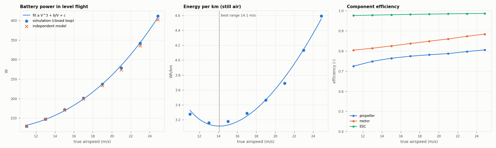
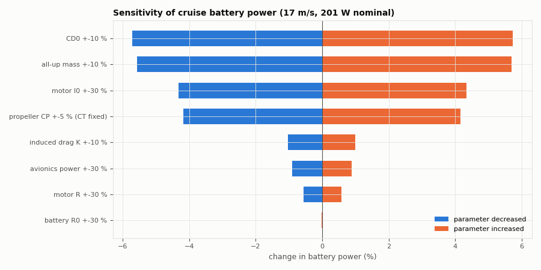

# UAV Energy Lab - Verification & Validation report

uavlab 0.1.0, JSBSim 1.3.1, generated 2026-09-24T04:17:18, wall time 609 s. **19/19 checks passed.**

| ID | Check | Criterion | Result | Pass |
|---|---|---|---|---|
| V1 | Atmosphere vs U.S. Standard Atmosphere 1976 | max relative error of T, p, rho at 0-11 km < 0.2 % | 0.0010 % | PASS |
| V2 | Wind injection and wind triangle in JSBSim | JSBSim total wind = mean + gust inputs and |V_ground - W| = TAS, error < 1e-6 m/s | 3.46e-09 m/s | PASS |
| V3 | Dryden turbulence statistics (lab generator) | sigma within 5 % and mean PSD ratio within +-0.5 dB (0.05-5 rad/s) for u, v, w | max sigma err 1.02 %, max PSD 0.02 dB | PASS |
| V4 | Discrete 1-cosine gust | max deviation from V = A/2 (1 - cos(2 pi t / T)) < 1e-9 m/s | 3.1e-16 m/s | PASS |
| V5 | Battery equivalent-circuit model | coulomb count exact (<1e-9); chem = terminal + R0 + R1 heat + C1 storage (<1e-9 rel.); instantaneous drop = I R0 and 5-tau drop = I (R0 + R1(1-e^-5)) within 0.1 % | SOC err 3.3e-12, energy balance 3.1e-14, step 0.000%/0.000% | PASS |
| V6 | Motor model (Drela first-order) | zero torque at analytic no-load speed; peak-efficiency current = sqrt(I0 V / R) within 1 %; efficiency < 1 | no-load torque 2.2e-15 Nm, I_best 39.72 A vs 39.80 A, eta_max 0.912 | PASS |
| V7 | Powertrain network solver | 3000 random operating points (all 3 ESC regimes): KVL residual < 1e-9 V, power balance battery = ESC + avionics, ESC = motor + loss, motor = shaft + copper + iron (<1e-9 rel.) | KVL 1.1e-14 V, balance 5.6e-16, regimes ['freewheel', 'limited', 'normal'] | PASS |
| V8 | Propeller/motor co-simulation, static run-up | steady RPM and thrust from JSBSim+powertrain vs independent torque-balance root-find within 0.5 % | 0.006 % | PASS |
| V9 | Steady flight: full pipeline vs independent trim model | battery power within 3 %, RPM within 1 %, angle of attack within 0.3 deg at every speed; logged lift within 2 % of weight | max errors: P 2.18 %, rpm 0.38 %, alpha 0.030 deg, lift/weight 1.69 % | PASS |
| V10 | Mechanical energy closure in flight | |dE_air - (aero + propulsive + gear + wind work)| < 0.1 % of gross work for the lab's wind models (0.2 % with JSBSim's turbulence, whose rotational gust terms are not in the closure) | worst 0.04 of limit | PASS |
| V11 | Time-step convergence | total battery energy and flight time change < 1 % when the physics step is halved (5 ms -> 2.5 ms) | energy 0.018 %, time 0.027 % | PASS |
| V12 | Reproducibility | identical seed -> bit-identical time series; different seed -> different turbulence realisation | identical=True, differs=True | PASS |
| V13 | Closed-loop full flights, 8 wind scenarios (take-off to full stop) | all land on the runway (touchdown 0-150 m past the threshold, < 10 m off the centre line); touchdown sink < 1.6 m/s in smooth air, < 2.5 m/s in turbulence; steady cross-track RMS < 6 m (strong-wind stress case, wind close to the cruise airspeed on up-wind legs: tracking not required) | 8/8 pass | PASS |
| V14 | Wind-energy physics on head-wind / tail-wind legs | steady-leg battery energy within 3 % of E = P(V_a) d / V_g (still-air performance map + configured wind profile), and head-wind legs cost > 2x tail-wind legs per km | worst 1.63 % | PASS |
| V15 | Control-surface sign conventions | +aileron -> +roll rate, +elevator -> nose-down, +rudder -> nose-left (as the controllers assume) | dp=+0.262, dq=-0.151, dr=-0.134 rad/s | PASS |
| V16 | Configuration validation | invalid values and unknown keys are rejected | 4/4 rejected | PASS |
| V17 | Landing reliability in light turbulence (8 seeds) | every flight lands on the runway; 95th-percentile touchdown sink < 2.5 m/s | 8/8 landed, sink P95 1.36 m/s | PASS |
| U1 | Uncertainty: parameter sensitivity of cruise power | informative: one-at-a-time perturbation of uncertain [REP] parameters | largest: CD0 +-10 % (-5.7 / +5.7 %) | PASS |
| D1 | Demonstration: wind-aware speed-to-fly policy (online optimiser slot) | informative: same route and wind, fixed 17 m/s vs wind_aware_best_range policy | mission-leg energy 64.49 -> 60.33 Wh (+6.4 % saving) | PASS |

## V1 Atmosphere vs U.S. Standard Atmosphere 1976

*Criterion:* max relative error of T, p, rho at 0-11 km < 0.2 %

*Result:* 0.0010 % - **PASS**

h=      0 m: T  288.150/ 288.150 K, p  101325.5/ 101325.0 Pa, rho 1.22501/1.22500  
h=   1000 m: T  281.650/ 281.650 K, p   89875.0/  89874.6 Pa, rho 1.11165/1.11164  
h=   2000 m: T  275.150/ 275.150 K, p   79495.6/  79495.2 Pa, rho 1.00650/1.00649  
h=   5000 m: T  255.650/ 255.650 K, p   54020.1/  54019.9 Pa, rho 0.73612/0.73612  
h=  11000 m: T  216.650/ 216.650 K, p   22632.1/  22632.1 Pa, rho 0.36392/0.36392

## V2 Wind injection and wind triangle in JSBSim

*Criterion:* JSBSim total wind = mean + gust inputs and |V_ground - W| = TAS, error < 1e-6 m/s

*Result:* 3.46e-09 m/s - **PASS**

## V3 Dryden turbulence statistics (lab generator)

*Criterion:* sigma within 5 % and mean PSD ratio within +-0.5 dB (0.05-5 rad/s) for u, v, w

*Result:* max sigma err 1.02 %, max PSD 0.02 dB - **PASS**

V=17.0 m/s, h=100.0 m, W20=10.0 m/s, 24 seeds x 3000 s. sigma target u/v/w 1.380/1.380/1.000 m/s, errors -1.02%, +0.09%, -0.16%; mean PSD ratio in 0.05-5 rad/s: -0.01 dB, +0.01 dB, +0.02 dB

## V4 Discrete 1-cosine gust

*Criterion:* max deviation from V = A/2 (1 - cos(2 pi t / T)) < 1e-9 m/s

*Result:* 3.1e-16 m/s - **PASS**

## V5 Battery equivalent-circuit model

*Criterion:* coulomb count exact (<1e-9); chem = terminal + R0 + R1 heat + C1 storage (<1e-9 rel.); instantaneous drop = I R0 and 5-tau drop = I (R0 + R1(1-e^-5)) within 0.1 %

*Result:* SOC err 3.3e-12, energy balance 3.1e-14, step 0.000%/0.000% - **PASS**

pack R0=19.0 mOhm, R1=9.0 mOhm, tau=30.0 s, capacity 10.0 Ah, energy 231.5 Wh

## V6 Motor model (Drela first-order)

*Criterion:* zero torque at analytic no-load speed; peak-efficiency current = sqrt(I0 V / R) within 1 %; efficiency < 1

*Result:* no-load torque 2.2e-15 Nm, I_best 39.72 A vs 39.80 A, eta_max 0.912 - **PASS**

## V7 Powertrain network solver

*Criterion:* 3000 random operating points (all 3 ESC regimes): KVL residual < 1e-9 V, power balance battery = ESC + avionics, ESC = motor + loss, motor = shaft + copper + iron (<1e-9 rel.)

*Result:* KVL 1.1e-14 V, balance 5.6e-16, regimes ['freewheel', 'limited', 'normal'] - **PASS**

## V8 Propeller/motor co-simulation, static run-up

*Criterion:* steady RPM and thrust from JSBSim+powertrain vs independent torque-balance root-find within 0.5 %

*Result:* 0.006 % - **PASS**

duty 0.3: rpm  2172.3 vs  2172.3, thrust   5.94 vs   5.94 N, I_batt   2.3 A  
duty 0.6: rpm  4237.9 vs  4237.9, thrust  22.95 vs  22.95 N, I_batt  12.9 A  
duty 1.0: rpm  6542.7 vs  6542.6, thrust  56.98 vs  56.97 N, I_batt  60.4 A

## V9 Steady flight: full pipeline vs independent trim model

*Criterion:* battery power within 3 %, RPM within 1 %, angle of attack within 0.3 deg at every speed; logged lift within 2 % of weight

*Result:* max errors: P 2.18 %, rpm 0.38 %, alpha 0.030 deg, lift/weight 1.69 % - **PASS**

V= 11.0 m/s: P_batt  129.7 W (model  129.6, +0.07%), rpm   3434 (+0.02%), alpha  7.61 deg (-0.030), L/D  9.37, eta prop/motor/esc 0.724/0.804/0.975  
V= 13.0 m/s: P_batt  147.7 W (model  147.2, +0.40%), rpm   3747 (+0.11%), alpha  4.68 deg (-0.022), L/D  9.26, eta prop/motor/esc 0.748/0.813/0.977  
V= 15.0 m/s: P_batt  171.6 W (model  170.3, +0.75%), rpm   4104 (+0.19%), alpha  2.81 deg (-0.017), L/D  8.84, eta prop/motor/esc 0.764/0.825/0.979  
V= 17.0 m/s: P_batt  201.2 W (model  198.9, +1.13%), rpm   4486 (+0.26%), alpha  1.55 deg (-0.013), L/D  8.27, eta prop/motor/esc 0.774/0.837/0.981  
V= 19.0 m/s: P_batt  236.8 W (model  233.3, +1.46%), rpm   4885 (+0.31%), alpha  0.66 deg (-0.011), L/D  7.64, eta prop/motor/esc 0.781/0.848/0.983  
V= 21.0 m/s: P_batt  278.8 W (model  273.7, +1.88%), rpm   5297 (+0.36%), alpha  0.00 deg (-0.009), L/D  6.99, eta prop/motor/esc 0.787/0.859/0.984  
V= 23.0 m/s: P_batt  342.1 W (model  335.0, +2.10%), rpm   5766 (+0.38%), alpha -0.49 deg (-0.008), L/D  6.04, eta prop/motor/esc 0.797/0.873/0.985  
V= 24.9 m/s: P_batt  411.1 W (model  402.3, +2.18%), rpm   6206 (+0.38%), alpha -0.85 deg (-0.007), L/D  5.29, eta prop/motor/esc 0.805/0.883/0.986  
Best-endurance speed 11.0 m/s, best-range speed 14.1 m/s, minimum 3.11 Wh/km (still air, rho=1.143). Remaining differences come from lateral-directional trim drag (sideslip/rudder for the yaw-trim term and propeller torque), which the independent model omits.

## V10 Mechanical energy closure in flight

*Criterion:* |dE_air - (aero + propulsive + gear + wind work)| < 0.1 % of gross work for the lab's wind models (0.2 % with JSBSim's turbulence, whose rotational gust terms are not in the closure)

*Result:* worst 0.04 of limit - **PASS**

calm: residual -0.08 J (7.8e-07 of gross work), wind work +0.000 Wh  
steady_headwind_6: residual -0.17 J (1.4e-06 of gross work), wind work +0.036 Wh  
crosswind_6: residual -4.92 J (4.0e-05 of gross work), wind work +0.803 Wh  
turbulent_light: residual -5.26 J (3.6e-05 of gross work), wind work +1.078 Wh  
gusty: residual -4.84 J (4.2e-05 of gross work), wind work +0.597 Wh  
time_varying: residual +3.30 J (2.6e-05 of gross work), wind work +0.108 Wh  
turbulent_jsbsim: residual -0.15 J (9.5e-07 of gross work), wind work +0.041 Wh  
strong_wind: residual -5.78 J (1.4e-05 of gross work), wind work +3.117 Wh

## V11 Time-step convergence

*Criterion:* total battery energy and flight time change < 1 % when the physics step is halved (5 ms -> 2.5 ms)

*Result:* energy 0.018 %, time 0.027 % - **PASS**

5 ms: 23.330 Wh / 427.3 s; 2.5 ms: 23.334 Wh / 427.4 s

## V12 Reproducibility

*Criterion:* identical seed -> bit-identical time series; different seed -> different turbulence realisation

*Result:* identical=True, differs=True - **PASS**

## V13 Closed-loop full flights, 8 wind scenarios (take-off to full stop)

*Criterion:* all land on the runway (touchdown 0-150 m past the threshold, < 10 m off the centre line); touchdown sink < 1.6 m/s in smooth air, < 2.5 m/s in turbulence; steady cross-track RMS < 6 m (strong-wind stress case, wind close to the cruise airspeed on up-wind legs: tracking not required)

*Result:* 8/8 pass - **PASS**

PASS calm: LANDED, 23.33 Wh, 3.49 Wh/km, touchdown sink 0.48 m/s at 41.8 m / 0.45 m, steady xtrack RMS 0.78 m, decisions ['D1_runway', 'D2_go']  
PASS steady_headwind_6: LANDED, 29.42 Wh, 4.46 Wh/km, touchdown sink 0.92 m/s at 28.5 m / 0.7 m, steady xtrack RMS 0.97 m, decisions ['D1_runway', 'D2_go']  
PASS crosswind_6: LANDED, 27.51 Wh, 4.07 Wh/km, touchdown sink 0.93 m/s at 28.4 m / 1.12 m, steady xtrack RMS 0.95 m, decisions ['D1_runway', 'D2_go', 'D9_gust_approach_speed', 'D7_reflare']  
PASS turbulent_light: LANDED, 32.35 Wh, 4.76 Wh/km, touchdown sink 0.87 m/s at 35.3 m / 0.88 m, steady xtrack RMS 1.07 m, decisions ['D1_runway', 'D2_go', 'D9_gust_approach_speed', 'D7_reflare', 'D7_reflare']  
PASS gusty: LANDED, 26.18 Wh, 3.94 Wh/km, touchdown sink 1.23 m/s at 28.2 m / 0.39 m, steady xtrack RMS 0.93 m, decisions ['D1_runway', 'D2_go', 'D9_gust_approach_speed', 'D7_reflare', 'D7_reflare']  
PASS time_varying: LANDED, 29.31 Wh, 4.51 Wh/km, touchdown sink -0.01 m/s at 1.1 m / 2.14 m, steady xtrack RMS 0.88 m, decisions ['D1_runway', 'D2_go', 'D9_gust_approach_speed', 'D7_reflare', 'D7_reflare']  
PASS turbulent_jsbsim: LANDED, 39.20 Wh, 5.64 Wh/km, touchdown sink 1.22 m/s at 110.3 m / 0.46 m, steady xtrack RMS 4.29 m, decisions ['D1_runway', 'D2_go', 'D9_gust_approach_speed', 'D7_reflare']  
PASS strong_wind: LANDED, 92.32 Wh, 15.13 Wh/km, touchdown sink 1.84 m/s at 13.8 m / -0.11 m, steady xtrack RMS 59.32 m, decisions ['D1_runway', 'D2_go', 'D5_energy_insufficient', 'D9_gust_approach_speed', 'D7_reflare', 'D7_reflare', 'D7_reflare']

## V14 Wind-energy physics on head-wind / tail-wind legs

*Criterion:* steady-leg battery energy within 3 % of E = P(V_a) d / V_g (still-air performance map + configured wind profile), and head-wind legs cost > 2x tail-wind legs per km

*Result:* worst 1.63 % - **PASS**

leg W_END (steady 229 s, 1.99 km): tail-wind -8.32 m/s, ground speed 8.71 (pred 8.67) m/s, energy 12.89 Wh vs predicted 12.68 Wh (+1.63 %), 6.47 Wh/km  
leg E_END (steady 150 s, 3.81 km): tail-wind +8.34 m/s, ground speed 25.32 (pred 25.34) m/s, energy 8.40 Wh vs predicted 8.30 Wh (+1.26 %), 2.21 Wh/km  
leg W_END2 (steady 494 s, 4.27 km): tail-wind -8.32 m/s, ground speed 8.65 (pred 8.67) m/s, energy 27.62 Wh vs predicted 27.22 Wh (+1.48 %), 6.46 Wh/km  
leg E_END2 (steady 115 s, 2.92 km): tail-wind +8.34 m/s, ground speed 25.37 (pred 25.34) m/s, energy 6.44 Wh vs predicted 6.35 Wh (+1.34 %), 2.21 Wh/km  
Whole legs (incl. turns/climb), from legs.csv: nan 20.84 Wh/km; W_END 7.00 Wh/km; E_END 2.30 Wh/km; W_END2 6.37 Wh/km; E_END2 2.34 Wh/km

## V15 Control-surface sign conventions

*Criterion:* +aileron -> +roll rate, +elevator -> nose-down, +rudder -> nose-left (as the controllers assume)

*Result:* dp=+0.262, dq=-0.151, dr=-0.134 rad/s - **PASS**

## V16 Configuration validation

*Criterion:* invalid values and unknown keys are rejected

*Result:* 4/4 rejected - **PASS**

## V17 Landing reliability in light turbulence (8 seeds)

*Criterion:* every flight lands on the runway; 95th-percentile touchdown sink < 2.5 m/s

*Result:* 8/8 landed, sink P95 1.36 m/s - **PASS**

seed 100: LANDED, sink 0.58 m/s, touchdown 29.8 m / 0.29 m, bounces 1, energy 32.80 Wh  
seed 101: LANDED, sink 0.87 m/s, touchdown 24.9 m / 1.7 m, bounces 0, energy 33.53 Wh  
seed 102: LANDED, sink 0.39 m/s, touchdown 18.3 m / 0.09 m, bounces 2, energy 33.13 Wh  
seed 103: LANDED, sink 1.42 m/s, touchdown 19.0 m / 1.7 m, bounces 2, energy 32.11 Wh  
seed 104: LANDED, sink 1.24 m/s, touchdown 33.9 m / 0.32 m, bounces 2, energy 35.00 Wh  
seed 105: LANDED, sink 0.75 m/s, touchdown 39.3 m / 1.06 m, bounces 0, energy 32.63 Wh  
seed 106: LANDED, sink 0.93 m/s, touchdown 42.3 m / 1.92 m, bounces 0, energy 34.97 Wh  
seed 107: LANDED, sink 0.78 m/s, touchdown 16.2 m / 2.44 m, bounces 1, energy 34.32 Wh  
Touchdown sink mean 0.87 m/s, 95th percentile 1.36 m/s; bounces per landing mean 1.0 (each recovered by the re-flare logic). Mission energy spread across seeds 1.02 Wh (1 sigma).

## U1 Uncertainty: parameter sensitivity of cruise power

*Criterion:* informative: one-at-a-time perturbation of uncertain [REP] parameters

*Result:* largest: CD0 +-10 % (-5.7 / +5.7 %) - **PASS**

CD0 +-10 %: -5.72 % / +5.74 %  
all-up mass +-10 %: -5.56 % / +5.70 %  
motor I0 +-30 %: -4.31 % / +4.35 %  
propeller CP +-5 % (CT fixed): -4.18 % / +4.16 %  
induced drag K +-10 %: -1.04 % / +1.00 %  
avionics power +-30 %: -0.90 % / +0.89 %  
motor R +-30 %: -0.56 % / +0.58 %  
battery R0 +-30 %: -0.00 % / -0.02 %

## D1 Demonstration: wind-aware speed-to-fly policy (online optimiser slot)

*Criterion:* informative: same route and wind, fixed 17 m/s vs wind_aware_best_range policy

*Result:* mission-leg energy 64.49 -> 60.33 Wh (+6.4 % saving) - **PASS**

fixed: total 72.94 Wh, 1330 s; policy: total 68.72 Wh, 1266 s
